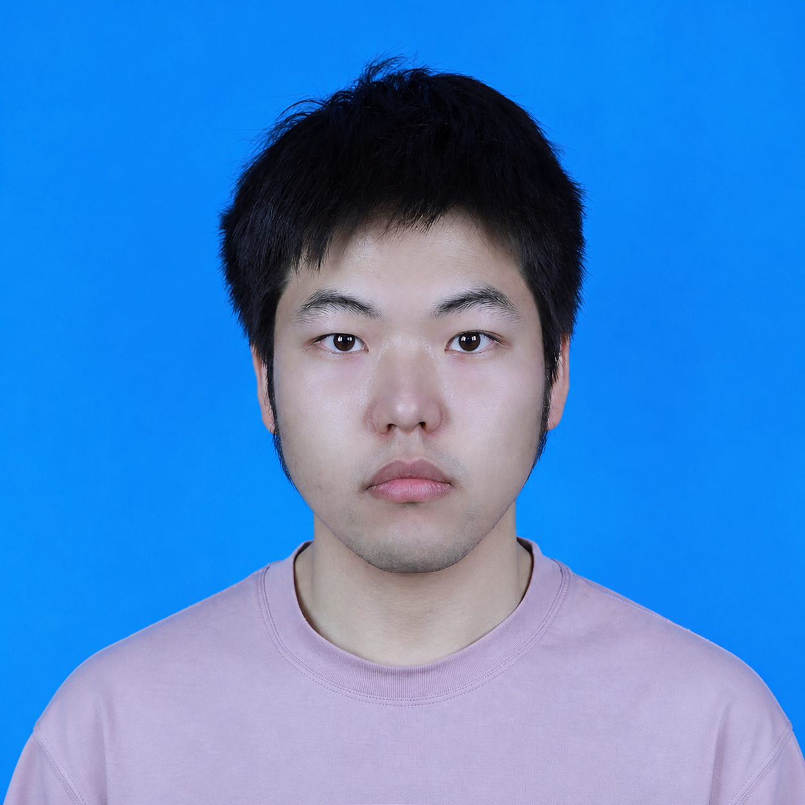

<!-- Generated from profile.json by scripts/build_profile.py. -->

### Shan Zhong

**Associate Researcher**  
[University of Electronic Science and Technology of China](https://en.uestc.edu.cn/)

[Email](mailto:202211040927@std.uestc.edu.cn) / [GitHub](https://github.com/smartXiaoz) / [ORCID](https://orcid.org/0009-0007-0802-0902)

I am an Associate Researcher at the University of Electronic Science and Technology of China (UESTC). I received my Ph.D. in Mechanical Engineering (Robotics) from UESTC under the supervision of Prof. Bei Peng. From 2024 to 2025, I was a CSC-sponsored visiting Ph.D. researcher at Nanyang Technological University, working with Prof. Tee Hiang Cheng.

My research interests include embodied intelligence, reinforcement learning, generative models, and signal processing. My current work focuses on diffusion- and flow-based reinforcement learning, multimodal policy and value representations, entropy estimation for exploration, and robust estimation under non-Gaussian noise.

 

## Selected Publications

1. **Information Potential: A Novel Guidance Framework for Diffusion Reinforcement Learning**  
   Shan Zhong, et al.. *IEEE Transactions on Industrial Electronics*, 2026. [paper](https://doi.org/10.1109/TIE.2026.3699885)

2. **MAD3PG: A Framework for Multi-Agent Deep Denoising Diffusion Policy Gradient Optimization**  
   Shan Zhong, Gang Wang, Jingkui Zhang, et al.. *Information Fusion*, 129:104026, 2026. [paper](https://doi.org/10.1016/j.inffus.2025.104026) / [code](https://github.com/smartXiaoz/MAD3PG)

3. **Online Graph Models: Tackling the Challenges of Non-Gaussian Noise in Adaptive Filtering**  
   Shan Zhong, Gang Wang, Kah Chan Teh, Jiacheng He, Tee Hiang Cheng, Bei Peng. *IEEE Transactions on Neural Networks and Learning Systems*, 2025. [paper](https://doi.org/10.1109/TNNLS.2025.3553872) / [code](https://github.com/smartXiaoz/GS-RAF)

4. **Outlier-Aware Recursive Instantaneous Minimum Error Entropy Algorithm**  
   Shan Zhong, Bei Peng, Ziyi Wang, et al.. *IEEE Transactions on Systems, Man, and Cybernetics: Systems*, 55(6):4076–4090, 2025. [paper](https://doi.org/10.1109/TSMC.2025.3547378)

5. **Kalman Filtering Based on Dynamic Perception of Measurement Noise**  
   Shan Zhong, Bei Peng, Jiacheng He, et al.. *Mechanical Systems and Signal Processing*, 213:111343, 2024. [paper](https://doi.org/10.1016/j.ymssp.2024.111343) / [code](https://github.com/smartXiaoz/DAKF)

6. **Robust Adaptive Filtering Based on M-estimation-based Minimum Error Entropy Criterion**  
   Shan Zhong, Ziyi Wang, Gang Wang, et al.. *Information Sciences*, 658:120026, 2024. [paper](https://doi.org/10.1016/j.ins.2023.120026) / [code](https://github.com/smartXiaoz/MMEE)

7. **A Pseudolinear Maximum Correntropy Kalman Filter Framework for Bearings-Only Target Tracking**  
   Shan Zhong, Bei Peng, Li Ouyang, et al.. *IEEE Sensors Journal*, 23(17):19524–19538, 2023. [paper](https://doi.org/10.1109/JSEN.2023.3283863)

### Preprint

**FlowCritic: Bridging Value Estimation with Flow Matching in Reinforcement Learning**  
   Shan Zhong, Shutong Ding, He Diao, Xiangyu Wang, Kah Chan Teh, Bei Peng. *arXiv:2510.22686*, 2025. [paper](https://arxiv.org/abs/2510.22686)

## Selected Awards

- Young Scientists Talent Cultivation Project — Doctoral Program, China Association for Science and Technology, 2025
- National Graduate Scholarship, 2025
- First Prize, Tencent Kaiwu AI Agent Challenge, 2025
- CSC Scholarship, 2024
- First place among university teams nationwide, Air–Underwater Confrontation Intelligent Agent Challenge, 2024

## Patents and Academic Service

I have filed five invention patents, two of which have been granted. I serve as a reviewer for journals including *IEEE Transactions on Neural Networks and Learning Systems* and *IEEE Transactions on Systems, Man, and Cybernetics: Systems*.
